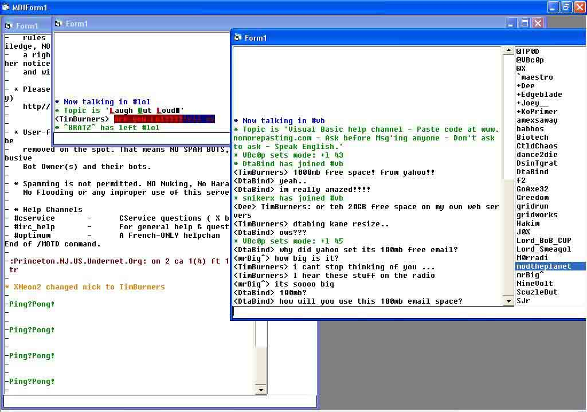



## Mirc Color Codes Full support

### Description

/l to connect
 
### More Info
 

             |
---                |---
**Submitted On**   |2004-06-18 18:54:08
**By**             |[Steadler](https://github.com/Planet-Source-Code/PSCIndex/blob/master/ByAuthor/steadler.md)
**Level**          |Advanced
**User Rating**    |4.0 (8 globes from 2 users)
**Compatibility**  |VB 5\.0, VB 6\.0
**Category**       |[Complete Applications](https://github.com/Planet-Source-Code/PSCIndex/blob/master/ByCategory/complete-applications__1-27.md)
**World**          |[Visual Basic](https://github.com/Planet-Source-Code/PSCIndex/blob/master/ByWorld/visual-basic.md)
**Archive File**   |[Mirc\_Color1759126192004\.zip](https://github.com/Planet-Source-Code/steadler-mirc-color-codes-full-support__1-54469/archive/master.zip)

